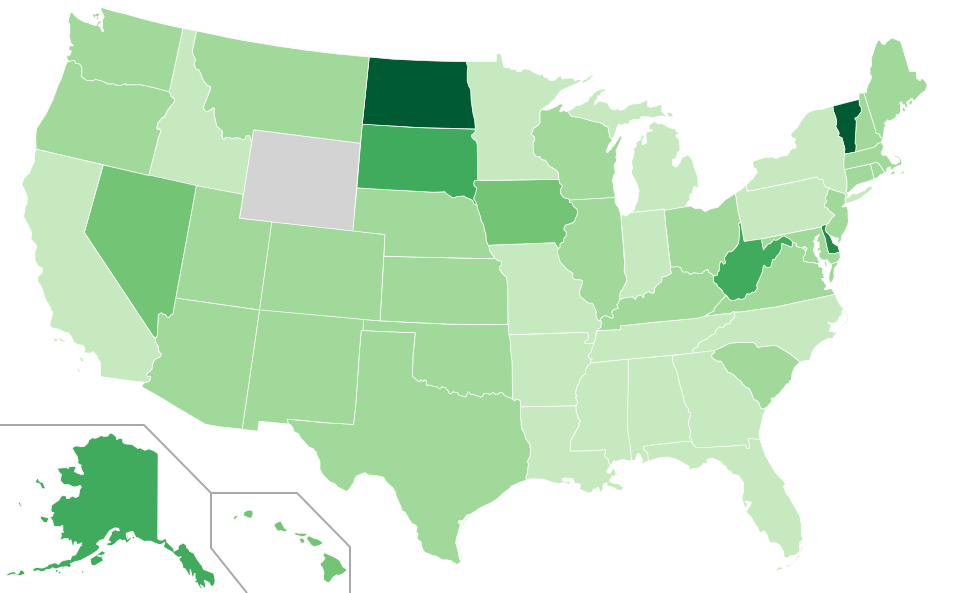
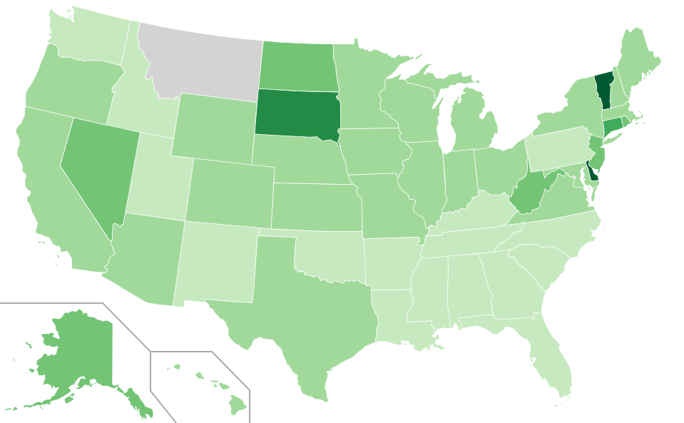

congress_words
=========

states.py takes your word or phrase of choice as an input and it outputs a map of the US showing how many times each state has a representative saying that word or phrase in congress, normalized by the number of congress members for each state. It outputs a .svg file.

It works using the API's of capitolwords.org, make sure to change my API key with yours when trying it out.

I make use of the BeautifulSoup module.

Here are two examples. The first is a map generated using the word 'war':

The second one is generated with 'peace':

wordplace.py, instead, just shows a histogram of how many times you sentence is used by each state.

