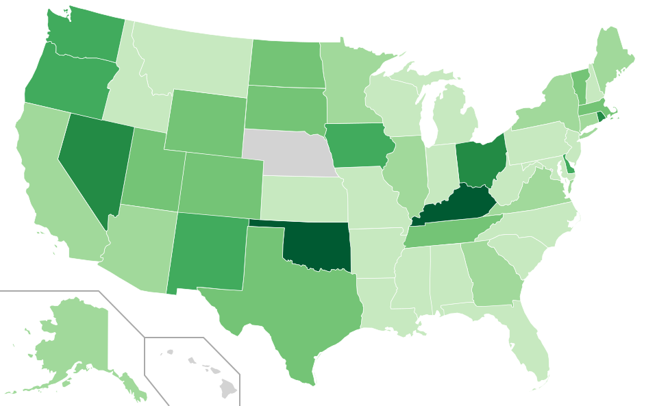
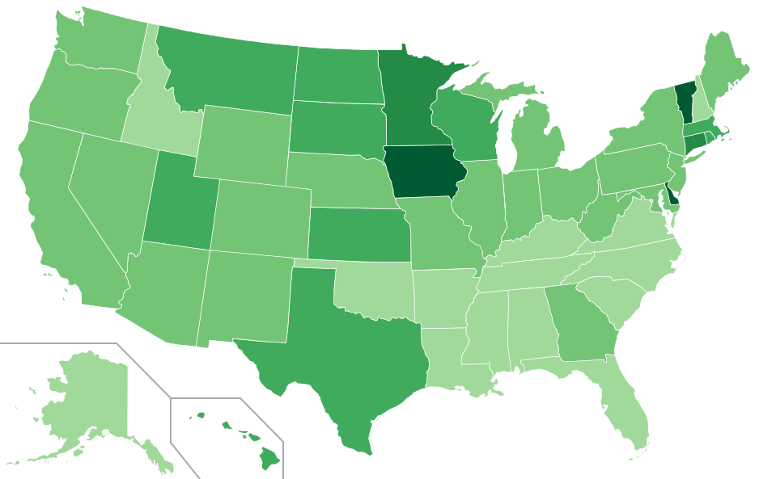

congress_words
=========

This project allows you to generate a map of the US based on many times a certain word or sentence has been pronunced in congress by a member of each state.

states.py takes your sentence of choice as an input and it outputs a map of the US showing how many times each state has had a representative saying that sentence in congress, normalized by the number of congress members for each state. The output is a .svg file.

The project works thanks to the API's of capitolwords.org. You need a key from capitolwords.org in order for the python script to work, so make sure to have one and change my API key with yours when trying it out.

Also, you need the BeautifulSoup module.

You can also checkout the online version [here](http://gobboph.github.io/congress_words/). The online version is written entirely in javascript instead of python and you can find the code in the gh-branch of this project. It has the enormous advantage that you do not need to worry about modules and keys, and it works right here in your browser, try it out!

wordplace.py is another short script that shows a histogram of how many times your sentence is used by each state. You can play around with that and use it as skeleton.

Here are two examples of what states.py does (although you can try it yourself [here](http://gobboph.github.io/congress_words/)). The first map is generated using the sentence 'green energy':

This one is generated using 'welfare':

Enjoy and let me know what you think.

[robertogobbetti.com](robertogobbetti.com)

